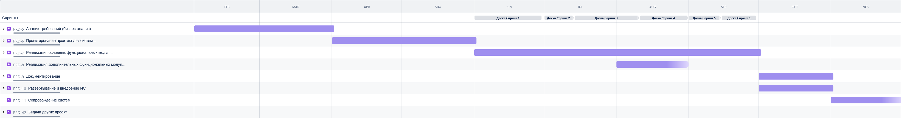

= Проект по разработке системы внедрения новых продуктов в сети столовых "Замысловатость"

== Описание проблематики
Ключевой задачей данного проекта является реализация механизмов упрощенного внедрения новых продуктов в сети межконтинентальных закусочных “Замысловатость”.

Текущий процесс организован крайне затруднительно, очень многим сотрудникам сети в целях внедрения нового продукта приходится взаимодействовать лично, и часто это занимает огромное количество времени (более 1 месяца, за это время конкуренты успевают внедрить по 6-7 новых продуктов), и артефакты их диалогов и результатов работы постоянно теряются. 

== Цели внедрения проекта
Реализация механизмов упрощенного внедрения новых продуктов в сети межконтинентальных закусочных “Замысловатость”.

Реализация новой информационной системы «Система управления продуктами». 
В рамках данной системы предлагается решать две основные задачи:

. упростить и автоматизировать процесс внедрения новых продуктов (исходная задача);
. обеспечить хранение и работу с существующими продуктами (напр., формирование отчетности, вывод продуктов из экплуатации) (дополнительные возможности системы, на будущее развитие);

== Описание методологии
Наиболее подходящей будет методология Agile, в частности, Scrum. Причины:

. Гибкость и адаптивность: Scrum позволяет быстро реагировать на изменения в требованиях и приоритетах, что особенно важно в условиях динамичного бизнеса, как в сфере общественного питания.
. теративный подход: Разработка ведется итерациями (спринтами), что позволяет регулярно получать рабочие версии продукта и проводить их тестирование. Это помогает выявлять и устранять проблемы на ранних стадиях.
. Сотрудничество и вовлеченность: Scrum поощряет активное взаимодействие между членами команды и заинтересованными сторонами, что способствует лучшему пониманию требований и ожиданий.
. Фокус на ценности для пользователя: Scrum ориентирован на создании ценности для конечного пользователя, что позволяет сосредоточиться на наиболее важных функциях и улучшениях.
. Регулярные проверки и улучшения: В Scrum предусмотрены регулярные встречи (например, ретроспективы), на которых команда может обсудить, что сработало хорошо, а что можно улучшить в следующем спринте.
. Предполагаем, что у существующих ИТ-команд компании есть опыт работы с Agile и Scrum, это может значительно ускорить процесс разработки и повысить качество конечного продукта. 

== Описание системы управления проектом
Используемая система: JIRA

Важные ссылки:

. link:https://bestdimaaa.atlassian.net/jira/software/projects/PRD/boards/1[Общая ссылка на проект JIRA]
. link:https://bestdimaaa.atlassian.net/issues/PRD-11?filter=10001[Список эпиков проекта]
. link:https://bestdimaaa.atlassian.net/jira/software/projects/PRD/boards/1/timeline[Диаграмма Ганта]
. link:https://bestdimaaa.atlassian.net/issues/PRD-15?filter=10002[Фильтр (бэклог) по задачам СА]
. link:https://bestdimaaa.atlassian.net/browse/PRD-7[Основной набор задач системного анализа]
. link:https://bestdimaaa.atlassian.net/jira/software/projects/PRD/boards/1/backlog[Распределение по спринтам]

== Диаграмма ганта

== Команда проекта

.Команда проекта
[cols="2*",options="header"]  
|=== 
|Должность|Основное назначение
|Стейкхолдер|Представитель от бизнеса
|Руководитель проекта|Общее управление
|Бизнес-аналитики|Понимание и сбор бизнес-требований
|Системные аналитики|Подготовка требований
|Разработчики|Реализация системы
|Тестировщики|Проверка качества реализации
|Devops-инженеры|Развертывание системы
|Сопровождение|Поддержка пользователей системы
|===

== Риски проекта

Потенциальные риски:

. Технические риски: Возможные проблемы синтеграцией новой системы с существующими ИТ-решениями.
. Изменения в требованиях: Изменения в бизнес-требованиях в процессе разработки могут привести к необходимости переработки.
. Недостаток ресурсов: Недостаток необходимых ресурсов (человеческих, финансовых, временных) может замедлить проект.
. Управление проектом: Неправильное управление проектом может привести к несоответствию сроков и бюджета.

link:docs\documents\presentation.pdf[Презентация]

== Описание выбранного решения

Реализация модуля «Система управления продуктами».
В рамках данной системы предлагается решать две основные задачи:

. сбор требований по новому продукту: запросы данных у смежных подразделений и фиксация их ответов (решений) в нашей системе. Для ряда систем предлагается использовать интеграционные решения, для ряда систем взаимодействие будет обеспечено через почтовые каналы связи.
. завершение внедрения нового продукта (ввод в эксплуатацию): взаимодействие со смежными отделами для внесения обновлений и изменений в их системы.

Основные модули системы:

[cols="2*",options="header"]  
|=== 
|Компоненты системы|Описание
| Модуль создания нового продукта|Форма для ввода данных о новом продукте (название, описание, ингредиенты и т.д.),
Валидация данных и сохранение в базе данных
| Модуль сбора требований|Интерфейс для запроса данных у смежных подразделений (напр., отдел закупок, отдел логистики), Хранение ответов и решений в системе 
| Модуль завершения внедрения| Инструменты для взаимодействия с другими приложениями (напр., платежные системы, сайты и мобильные приложения, системы внешних служб доставки)
| Интеграционные компоненты| API для взаимодействия с внешними системами (например, ERP, CRM), Механизмы для отправки уведомлений по электронной почте 
|===

Пользовательский сценарий:

== Описание архитектуры с НФТ

Вставить изображение архитектуры с пояснениями.

В связи с решением о применении в организации ISO/IEC 27001 для безопасности данных было принято решение реализовать применение НФТ в сервисе с наиболее чувствительными данными - сервисе "Система управления заказами"

.Нефункциональные требования
[options="header"]
|===
|Требование |Атрибут 
|Доступность	| 
|Минимальное время простоя	| 
|Быстрый доступ к системе	| 
|Быстродействие	|  
|Отзывчивость системы	| 
|Минимальное время ответа на запрос	|   
|Количество ошибок	|  
|Время восстановления после отказа системы	| 
|Защита от сбоев	|  
|Добавление новых точек входа для создания заказов	|  
|Горизонтальное масштабирование (увеличение мощности при увеличении количества заказов)	|  
|Противостояние несанкционированному доступу	|  
|Целостность данных	|  
|===

== Заключение

Реализация этого проекта позволит ...