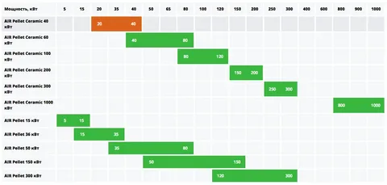

= ТЗ на разработку

== Usecase

. Пользователь нажимает кнопку ОК
. Система отправляет запрос 
* Здесь написано примачение
.. В подсистему 1
.. В подсистему 2
. Пользователь нажимает отмена
. Система выдает ошибку
* Всегда

link:https://github.com/bestdimaaa/DocsAsCode-practicum-TL-2024-09.git[Название ссылки, тут мой ГИТ]

*ЭТО ЖИРНЫЙ ШРИФТ*

_Курсив?_

[cols='2,1', options='header']
|===
|Заголовок 1|Заголовок 2
|Ячейка 1|Ячейка 2|Ячейка 3|Ячейка4
|Ячейка 5|Ячейка 6|
|===

